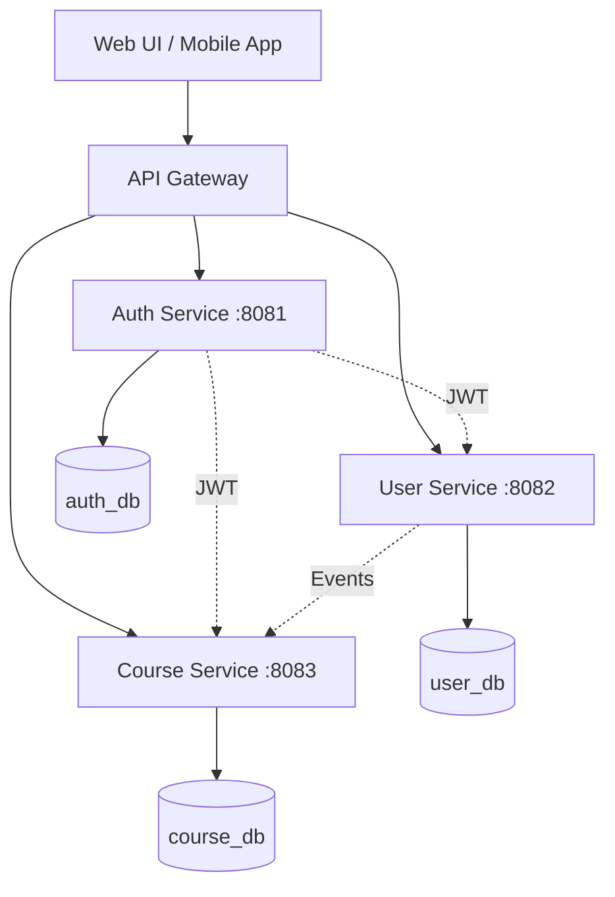
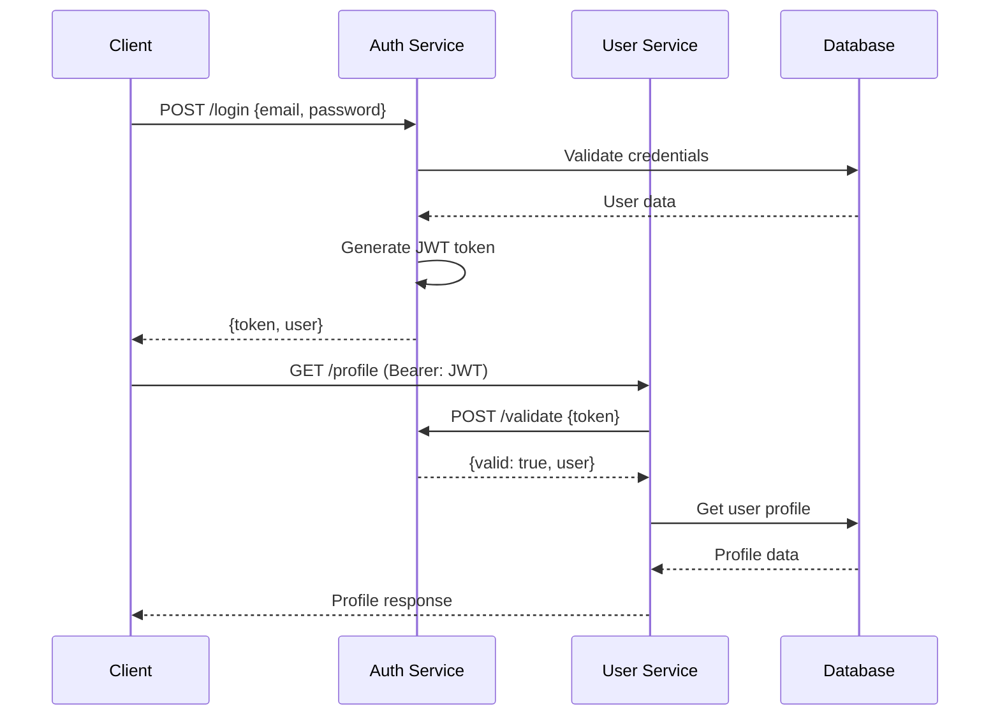

# System Patterns - Портал Обучения для Сотрудников

## Микросервисная Архитектура

### Высокоуровневая Схема



### Сервисы и Ответственности

```
┌─────────────────┬─────────────────┬─────────────────┐
│  Auth Service   │   User Service  │ Course Service  │
│     :8081       │     :8082       │     :8083       │
│                 │                 │                 │
│  Clean Arch ✅  │  Clean Arch ⏳  │  Clean Arch ⏳  │
│  - JWT токены   │  - Профили      │  - Курсы        │
│  - Регистрация  │  - Информация   │  - Модули       │
│  - Логин        │  - Должности    │  - Навыки       │
│  - Валидация    │  - Отделы       │  - Прогресс     │
│  - Роли         │  - Управление   │  - Roadmaps     │
└─────────────────┴─────────────────┴─────────────────┘
```

## Реализованные Архитектурные Паттерны

### 1. Clean Architecture (✅ Реализовано в Auth Service)

**Структура слоев:**
```
main.go (Composition Root)
    ↓ Dependencies Injection
internal/
├── handlers/          # Presentation Layer
│   ├── auth_handler.go   # HTTP обработчики
│   └── routes.go         # Маршруты
├── services/          # Business Logic Layer  
│   └── auth_service.go   # Чистая бизнес-логика
├── repositories/      # Data Access Layer
│   └── user_repository.go # Абстракция БД
└── models/            # Entities Layer
    ├── user.go           # Доменные модели
    ├── requests/         # Входящие данные
    └── responses/        # Исходящие данные
```

**Принципы зависимостей:**
- Внешние слои зависят от внутренних
- Зависимости инвертированы через интерфейсы
- main.go как единый Composition Root
- Никаких прямых зависимостей от конкретных реализаций

### 2. Repository Pattern (✅ Реализовано)

**Интерфейс:**
```go
type UserRepository interface {
    Create(*models.User) error
    GetByEmail(string) (*models.User, error)
    GetByID(uuid.UUID) (*models.User, error)
    EmailExists(string) (bool, error)
}
```

**Преимущества:**
- Абстракция от конкретной БД
- Легкое тестирование через моки
- Возможность смены БД без изменения логики
- Единый интерфейс для всех операций с данными

### 3. Service Layer Pattern (✅ Реализовано)

**Интерфейс:**
```go
type AuthService interface {
    Register(*requests.RegisterRequest) (*responses.TokenResponse, error)
    Login(*requests.LoginRequest) (*responses.TokenResponse, error)
    ValidateToken(string) (*models.User, error)
    GenerateToken(*models.User) (string, error)
}
```

**Ответственности:**
- Вся бизнес-логика изолирована в сервисах
- Валидация бизнес-правил
- Оркестрация вызовов репозиториев
- Генерация JWT токенов

### 4. Dependency Injection Pattern (✅ Реализовано)

**Composition Root в main.go:**
```go
func main() {
    // Инициализация зависимостей снизу вверх
    messages := ru.NewRussianMessages()
    configLoader := config.NewLoader(messages)
    cfg, _ := configLoader.Load()
    
    connectionManager := database.NewConnectionManager(messages)
    db := connectionManager.Connect(cfg)
    
    // Repository layer
    userRepo := repositories.NewUserRepository(db)
    
    // Service layer  
    authService := services.NewAuthService(userRepo, cfg.JWT.Secret, cfg.BCryptCost)
    
    // Handler layer
    authHandler := handlers.NewAuthHandler(authService, messages)
}
```

### 5. Request/Response Pattern (✅ Реализовано)

**Разделение моделей:**
```
models/
├── user.go              # Доменная модель (Entity)
├── requests/
│   └── auth_requests.go  # RegisterRequest, LoginRequest
└── responses/
    └── auth_responses.go # TokenResponse, ErrorResponse, StatusResponse
```

**Преимущества:**
- Четкое разделение внешнего API и внутренних моделей
- Валидация на границах системы
- Версионирование API без изменения доменных моделей

### 6. Internationalization Pattern (✅ Реализовано + РАСШИРЕНО)

**Централизованная архитектура системы сообщений для ВСЕГО приложения:**
```
internal/lang/
├── messages.go          # Интерфейсы, типы и константы ключей
│   ├── MessageKey type (типобезопасность)
│   ├── 37 ключей логирования (все уровни)
│   ├── Messages interface
│   └── MessageProvider implementation
└── ru/
    └── messages.go      # Русские переводы ВСЕХ сообщений
```

**Полная типизация ключей сообщений:**
```go
// Базовые ключи для API
const (
    UserNotFound         MessageKey = "auth.user.not_found"
    InvalidCredentials   MessageKey = "auth.credentials.invalid"
    UserAlreadyExists    MessageKey = "auth.user.already_exists"
)

// Логирование Handler уровня (10 ключей)
const (
    LogRegistrationRequest  MessageKey = "log.registration.request"
    LogLoginRequest         MessageKey = "log.login.request"
    LogValidationFailed     MessageKey = "log.validation.failed"
    LogRegistrationSuccess  MessageKey = "log.registration.success" 
    LogLoginSuccess         MessageKey = "log.login.success"
    LogGetMeFailed          MessageKey = "log.getme.failed"
    LogGetMeSuccess         MessageKey = "log.getme.success"
    LogParseRequestFailed   MessageKey = "log.parse.request.failed"
    // ... и другие
)

// Логирование Service уровня (13 ключей)  
const (
    LogAttemptingRegistration MessageKey = "log.service.attempting.registration"
    LogEmailAlreadyExists     MessageKey = "log.service.email.already.exists"
    LogPasswordHashError      MessageKey = "log.service.password.hash.error"
    LogRegistrationComplete   MessageKey = "log.service.registration.complete"
    LogAttemptingLogin        MessageKey = "log.service.attempting.login"
    LogLoginComplete          MessageKey = "log.service.login.complete"
    // ... и другие
)

// Логирование Repository уровня (5 ключей)
const (
    LogUserCreateSuccess MessageKey = "log.repo.user.create.success"
    LogUserCreateFailed  MessageKey = "log.repo.user.create.failed"
    LogUserNotFoundRepo  MessageKey = "log.repo.user.not.found"
    LogDatabaseError     MessageKey = "log.repo.database.error"
    LogEmailExistsCheck  MessageKey = "log.repo.email.exists.check"
)

// Логирование Middleware уровня (4 ключа)
const (
    LogJWTMissingHeader     MessageKey = "log.jwt.missing.header"
    LogJWTInvalidFormat     MessageKey = "log.jwt.invalid.format"
    LogJWTValidationFailed  MessageKey = "log.jwt.validation.failed"
    LogJWTValidationSuccess MessageKey = "log.jwt.validation.success"
)
```

**Паттерн использования с форматированием:**
```go
// В handlers - IP логирование
clientIP := c.IP()
log.Printf(h.messages.Get(lang.LogRegistrationRequest), clientIP)
log.Printf(h.messages.Get(lang.LogRegistrationSuccess), clientIP, req.Email)

// В services - бизнес-логика
log.Printf(s.messages.Get(lang.LogAttemptingRegistration), req.Email)
log.Printf(s.messages.Get(lang.LogEmailAlreadyExists), req.Email)

// В repositories - БД операции
log.Printf(r.messages.Get(lang.LogUserCreateSuccess), user.Email)
log.Printf(r.messages.Get(lang.LogDatabaseError), "email", email, err)

// В middleware - JWT валидация
log.Printf(messages.Get(lang.LogJWTValidationSuccess), clientIP, user.Email)

// API ответы
return errors.New(s.messages.Get(lang.UserAlreadyExists))
```

**Преимущества централизованной lang системы:**
- Абсолютно ВСЕ тексты через централизованную систему
- Типобезопасные ключи сообщений (нет опечаток)
- Единая система для API и логирования
- Легкое добавление новых языков
- Форматирование параметров через fmt.Sprintf
- Организация ключей по архитектурным уровням

### 7. Multi-level Logging Pattern (✅ Реализовано - НОВЫЙ)

**Централизованное логирование через lang систему по всем архитектурным уровням:**

```mermaid
graph TB
    H[Handler Level] --> |messages.Get()| L1[LogRegistrationRequest<br/>LogLoginRequest<br/>LogValidationFailed]
    S[Service Level] --> |messages.Get()| L2[LogAttemptingRegistration<br/>LogEmailAlreadyExists<br/>LogRegistrationComplete]
    R[Repository Level] --> |messages.Get()| L3[LogUserCreateSuccess<br/>LogDatabaseError<br/>LogEmailExistsCheck]
    M[Middleware Level] --> |messages.Get()| L4[LogJWTValidationSuccess<br/>LogJWTValidationFailed]
    
    L1 --> |Русские тексты| RU[ru/messages.go]
    L2 --> |Русские тексты| RU
    L3 --> |Русские тексты| RU
    L4 --> |Русские тексты| RU
```

**Паттерн интеграции messages во все компоненты:**

```go
// main.go - единый источник truth
func main() {
    messages := ru.NewRussianMessages()
    
    // Передача messages через всю архитектуру
    userRepo := repositories.NewUserRepository(db, messages)
    authService := services.NewAuthService(userRepo, cfg.JWT.Secret, cfg.BCryptCost, messages)
    authHandler := handlers.NewAuthHandler(authService, messages)
    jwtMiddleware := middleware.JWTMiddleware(authService, messages)
    
    // Все компоненты имеют доступ к централизованным сообщениям
}

// Repository Pattern с messages
type userRepository struct {
    db       *sqlx.DB
    messages lang.Messages  // Интеграция с lang системой
}

func NewUserRepository(db *sqlx.DB, messages lang.Messages) UserRepository {
    return &userRepository{db: db, messages: messages}
}

func (r *userRepository) Create(ctx context.Context, user *models.User) error {
    _, err := r.db.NamedExecContext(ctx, query, user)
    if err != nil {
        log.Printf(r.messages.Get(lang.LogUserCreateFailed), user.Email, err)
        return err
    }
    log.Printf(r.messages.Get(lang.LogUserCreateSuccess), user.Email)
    return nil
}

// Service Pattern с messages
type authService struct {
    userRepo   repositories.UserRepository
    jwtSecret  string
    bcryptCost int
    messages   lang.Messages  // Интеграция с lang системой
}

func NewAuthService(userRepo repositories.UserRepository, jwtSecret string, bcryptCost int, messages lang.Messages) AuthService {
    return &authService{userRepo: userRepo, jwtSecret: jwtSecret, bcryptCost: bcryptCost, messages: messages}
}

func (s *authService) Register(ctx context.Context, req *requests.RegisterRequest) (*responses.TokenResponse, error) {
    log.Printf(s.messages.Get(lang.LogAttemptingRegistration), req.Email)
    
    exists, err := s.userRepo.EmailExists(ctx, req.Email)
    if err != nil {
        log.Printf(s.messages.Get(lang.LogCheckEmailExists), req.Email, err)
        return nil, err
    }
    if exists {
        log.Printf(s.messages.Get(lang.LogEmailAlreadyExists), req.Email)
        return nil, errors.New(s.messages.Get(lang.UserAlreadyExists))
    }
    
    // ... business logic
    
    log.Printf(s.messages.Get(lang.LogRegistrationComplete), req.Email)
    return response, nil
}

// Handler Pattern с messages
type AuthHandler struct {
    authService services.AuthService
    validator   *validators.AuthValidator
    messages    lang.Messages  // Интеграция с lang системой
}

func NewAuthHandler(authService services.AuthService, messages lang.Messages) *AuthHandler {
    return &AuthHandler{
        authService: authService,
        validator:   validators.NewAuthValidator(messages),
        messages:    messages,
    }
}

func (h *AuthHandler) Register(c *fiber.Ctx) error {
    clientIP := c.IP()
    log.Printf(h.messages.Get(lang.LogRegistrationRequest), clientIP)
    
    // ... handler logic
    
    response, err := h.authService.Register(c.Context(), &req)
    if err != nil {
        log.Printf(h.messages.Get(lang.LogRegistrationFailed), clientIP, err)
        return c.Status(fiber.StatusBadRequest).JSON(fiber.Map{
            "error": err.Error(),
        })
    }
    
    log.Printf(h.messages.Get(lang.LogRegistrationSuccess), clientIP, req.Email)
    return c.JSON(response)
}

// Middleware Pattern с messages
func JWTMiddleware(authService services.AuthService, messages lang.Messages) fiber.Handler {
    return func(c *fiber.Ctx) error {
        clientIP := c.IP()
        
        authHeader := c.Get("Authorization")
        if authHeader == "" {
            log.Printf(messages.Get(lang.LogJWTMissingHeader), clientIP)
            return c.Status(fiber.StatusUnauthorized).JSON(fiber.Map{
                "error": messages.Get(lang.TokenNotProvided),
            })
        }
        
        // ... JWT validation
        
        log.Printf(messages.Get(lang.LogJWTValidationSuccess), clientIP, user.Email)
        return c.Next()
    }
}
```

**Архитектурные преимущества:**
- Консистентное логирование на всех уровнях
- Централизованные сообщения с IP адресами
- Единая система для всех архитектурных слоев
- Легкая трейсабилити запросов
- Типобезопасность всех сообщений

### 8. Testing Integration Pattern (✅ Реализовано - ОБНОВЛЕН)

**Интеграция централизованной lang системы в тестах:**

```go
// Repository тесты с lang интеграцией
func TestUserRepository_Create(t *testing.T) {
    db := setupTestDB(t)
    defer db.Close()

    // ОБЯЗАТЕЛЬНО: создание messages для каждого теста
    messages := ru.NewRussianMessages()
    repo := repositories.NewUserRepository(db, messages)

    user := &models.User{
        ID:       uuid.New(),
        Email:    "test@example.com",
        Password: "hashedpassword",
        Role:     "employee",
        Created:  time.Now(),
    }

    err := repo.Create(context.Background(), user)
    assert.NoError(t, err)
    // Репозиторий логирует через lang систему во время теста
}

// Service тесты с messages в моках
func TestAuthService_Register_Success(t *testing.T) {
    mockRepo := new(MockUserRepository)
    
    // ОБЯЗАТЕЛЬНО: messages объект для сервиса
    messages := ru.NewRussianMessages()
    authService := services.NewAuthService(mockRepo, "test-secret", 4, messages)

    req := &requests.RegisterRequest{
        Email:    "test@example.com",
        Password: "password123",
        Role:     "employee",
    }

    // Настройка моков
    mockRepo.On("EmailExists", mock.Anything, req.Email).Return(false, nil)
    mockRepo.On("Create", mock.Anything, mock.AnythingOfType("*models.User")).Return(nil)

    // Выполнение - сервис логирует через lang систему
    tokenResponse, err := authService.Register(context.Background(), req)

    require.NoError(t, err)
    assert.NotEmpty(t, tokenResponse.Token)
    mockRepo.AssertExpectations(t)
}

// Обновленные mock интерфейсы с messages поддержкой
type MockUserRepository struct {
    mock.Mock
}

func (m *MockUserRepository) Create(ctx context.Context, user *models.User) error {
    args := m.Called(ctx, user)
    return args.Error(0)
}

// Все методы принимают context как первый параметр
func (m *MockUserRepository) GetByEmail(ctx context.Context, email string) (*models.User, error) {
    args := m.Called(ctx, email)
    if args.Get(0) == nil {
        return nil, args.Error(1)
    }
    return args.Get(0).(*models.User), args.Error(1)
}

// Тестирование обновленных expectations для сообщений
func TestAuthService_Login_InvalidCredentials(t *testing.T) {
    mockRepo := new(MockUserRepository)
    messages := ru.NewRussianMessages()
    authService := services.NewAuthService(mockRepo, "test-secret", 4, messages)

    // ... setup

    tokenResponse, err := authService.Login(context.Background(), req)

    assert.Error(t, err)
    assert.Nil(t, tokenResponse)
    // ОБНОВЛЕНО: проверка правильного регистра через lang систему
    assert.Contains(t, err.Error(), "Неверный email или пароль")  // Не "неверный"!
}
```

**Тестовые стандарты с lang системой:**
- Каждый тест создает `messages := ru.NewRussianMessages()`
- Все конструкторы требуют messages параметр
- Mock объекты работают с обновленными интерфейсами
- Проверка сообщений через lang систему (правильный регистр)
- Логирование во время тестов через централизованные сообщения

## Межсервисное Взаимодействие

### JWT-based Authentication Flow



### Database Architecture

**Отдельные БД для каждого сервиса:**
```sql
-- auth_db
CREATE TABLE users (
    id UUID PRIMARY KEY,
    email VARCHAR UNIQUE NOT NULL,
    password_hash VARCHAR NOT NULL,
    role VARCHAR NOT NULL,
    created_at TIMESTAMP DEFAULT NOW()
);

-- user_db  
CREATE TABLE user_profiles (
    user_id UUID PRIMARY KEY,
    first_name VARCHAR,
    last_name VARCHAR,
    position VARCHAR,
    department VARCHAR,
    hire_date DATE
);

-- course_db
CREATE TABLE courses (
    id UUID PRIMARY KEY,
    title VARCHAR NOT NULL,
    description TEXT,
    duration_hours INTEGER,
    difficulty_level VARCHAR
);
```

## Качество и Тестирование

### Testing Strategy (✅ Реализовано для Auth Service)

**Пирамида тестирования:**
```
                  E2E Tests
                     🔺
                Integration Tests  
                   🔺🔺🔺
              Unit Tests (27 тестов)
            🔺🔺🔺🔺🔺🔺🔺🔺🔺
```

**Coverage по слоям:**
- Config Layer: 100% (loader, validator)
- Validation Layer: 100% (все сценарии)
- Repository Layer: 83% (mock БД)
- Service Layer: 88% (mock репозиториев)
- **Общее покрытие: 78%**

### Error Handling Patterns

**Многоуровневая обработка ошибок:**
```go
// Service Layer - бизнес ошибки
if exists {
    return nil, errors.New(messages.Get(lang.UserAlreadyExists))
}

// Handler Layer - HTTP ошибки  
return c.Status(fiber.StatusConflict).JSON(responses.ErrorResponse{
    Error: err.Error(),
})
```

## Security Patterns

### 1. Authentication & Authorization
- **JWT токены** с 24-часовым сроком действия
- **bcrypt** хеширование паролей (cost 12)
- **Role-based access** (employee/manager)

### 2. SQL Injection Protection
- **Параметризованные запросы** через sqlx
- **Named parameters** для INSERT операций
- **Никаких string concatenations** в SQL

### 3. Input Validation
- **Валидация на boundaries** (HTTP endpoints)
- **Структурная валидация** через go-playground/validator
- **Типобезопасные модели** для requests/responses

## Deployment Patterns

### Containerization
```dockerfile
# Multi-stage build для минимального образа
FROM golang:1.21-alpine AS builder
# ... build stage

FROM alpine:latest
# ... runtime stage  
```

### Service Discovery
```yaml
# docker-compose.yml
services:
  auth-service:
    ports: ["8081:8081"]
  user-service:  
    ports: ["8082:8082"]
  course-service:
    ports: ["8083:8083"]
  postgres:
    ports: ["5432:5432"]
```

## Будущие Паттерны

### Event-Driven Architecture
```go
// Планируется для User/Course Services
type Event struct {
    Type      string    `json:"type"`
    UserID    uuid.UUID `json:"user_id"`
    Payload   interface{} `json:"payload"`
    Timestamp time.Time `json:"timestamp"`
}
```

### API Gateway Pattern
```yaml
# Планируется
routes:
  - path: /api/auth/*
    service: auth-service:8081
  - path: /api/users/*  
    service: user-service:8082
  - path: /api/courses/*
    service: course-service:8083
```

## Выводы по Архитектуре

**Что работает отлично:**
- Clean Architecture обеспечивает maintainability
- Repository Pattern упрощает тестирование  
- Dependency Injection делает компоненты независимыми
- Интернационализация дает консистентность API

**Следующие шаги:**
- Применить те же паттерны в User Service
- Применить те же паттерны в Course Service  
- Добавить межсервисную коммуникацию
- Внедрить event-driven architecture

## Архитектурные принципы

### Clean Architecture
- **Разделение по слоям**: Каждый сервис структурирован по слоям ответственности
- **Dependency Inversion**: Все зависимости только через интерфейсы
- **Testability**: Архитектура позволяет легко тестировать каждый компонент

### Микросервисная архитектура
- **Независимые сервисы**: Каждый сервис отвечает за свою предметную область
- **API-first подход**: Все взаимодействие через REST API
- **Децентрализованные данные**: Каждый сервис имеет свою базу данных

## Структура проекта

### Текущая структура
```
services/
├── auth-service/          # Аутентификация и авторизация
├── user-service/          # Управление пользователями (планируется)
└── course-service/        # Управление курсами (планируется)
```

### Рекомендуемая полная структура репозитория

```
employee-learning-platform/
├── services/                           # Микросервисы (Go)
│   ├── auth-service/
│   ├── user-service/
│   ├── course-service/
│   └── notification-service/
├── web-app/                            # React фронтенд
│   ├── src/
│   │   ├── components/
│   │   ├── pages/
│   │   ├── services/                   # API клиенты
│   │   └── shared/
│   ├── public/
│   ├── package.json
│   └── Dockerfile
├── mobile-app/                         # Flutter приложение
│   ├── lib/
│   │   ├── features/
│   │   ├── shared/
│   │   └── services/                   # API клиенты
│   ├── android/
│   ├── ios/
│   └── pubspec.yaml
├── shared/                             # Общие ресурсы
│   ├── api-contracts/                  # OpenAPI спецификации
│   │   ├── auth-service.yaml
│   │   ├── user-service.yaml
│   │   └── course-service.yaml
│   ├── proto/                          # gRPC proto файлы (если нужно)
│   ├── types/                          # Общие типы данных
│   └── docs/                           # Архитектурная документация
├── infrastructure/                     # Инфраструктура и деплой
│   ├── docker/
│   │   ├── docker-compose.yml
│   │   ├── docker-compose.prod.yml
│   │   └── nginx/
│   ├── kubernetes/                     # K8s манифесты
│   └── terraform/                      # Infrastructure as Code
├── tools/                              # Инструменты разработки
│   ├── scripts/
│   │   ├── build-all.sh
│   │   ├── test-all.sh
│   │   └── deploy.sh
│   ├── ci-cd/
│   │   ├── .github/workflows/
│   │   └── gitlab-ci.yml
│   └── monitoring/                     # Логи, метрики
├── database/                           # Скрипты БД
│   ├── migrations/
│   └── seeds/
├── memory-bank/                        # Документация проекта
└── README.md
```

## Паттерны разработки

### Централизованная интернационализация
- **Lang система**: Все текстовые сообщения через `lang.Messages.Get()`
- **Типобезопасность**: `MessageKey` константы для всех сообщений
- **Архитектурная организация**: Ключи организованы по уровням (Handler, Service, Repository)
- **Форматирование**: Поддержка параметров через `fmt.Sprintf`

### Dependency Injection паттерн
- **Composition Root**: `main.go` как единственное место сборки зависимостей
- **Interface Segregation**: Небольшие, специфичные интерфейсы
- **Constructor Injection**: Все зависимости через конструкторы

### Repository паттерн
- **Абстракция данных**: Репозитории инкапсулируют логику работы с БД
- **Интерфейсы**: Все репозитории реализуют интерфейсы
- **Тестируемость**: Легкое мокирование для unit тестов

### Service слой паттерн
- **Бизнес-логика**: Вся бизнес-логика инкапсулирована в сервисах
- **Транзакционность**: Сервисы управляют транзакциями
- **Валидация**: Входные данные валидируются на уровне сервисов

### API паттерны
- **REST API**: Стандартные HTTP методы и статус коды
- **Request/Response модели**: Четкое разделение входных и выходных данных
- **Error Handling**: Централизованная обработка ошибок
- **JWT Authentication**: Stateless аутентификация

### Тестирование паттерны
- **Unit тесты**: Каждый компонент покрыт unit тестами
- **Integration тесты**: Тестирование взаимодействия компонентов
- **Test Doubles**: Использование моков и стабов
- **Coverage**: Контроль покрытия кода тестами

### Конфигурация паттерны
- **Environment Variables**: Конфигурация через переменные окружения
- **Config Validation**: Валидация конфигурации при старте
- **Multi-environment**: Поддержка разных окружений (dev, staging, prod)
- **Config Loader**: Централизованная загрузка конфигурации

### Логирование паттерны
- **Structured Logging**: Структурированные логи
- **Multi-level Logging**: Логирование на разных уровнях архитектуры
- **IP Tracking**: Отслеживание IP адресов в HTTP операциях
- **Internationalized Logs**: Все сообщения через lang систему

### База данных паттерны
- **Connection Management**: Управление подключениями к БД
- **Migration Scripts**: Версионирование схемы БД
- **Health Checks**: Проверка состояния БД